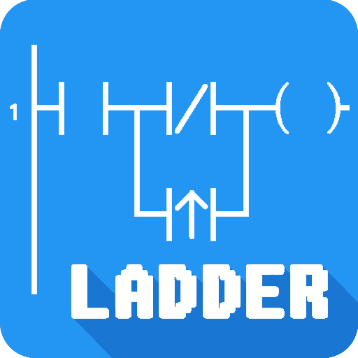
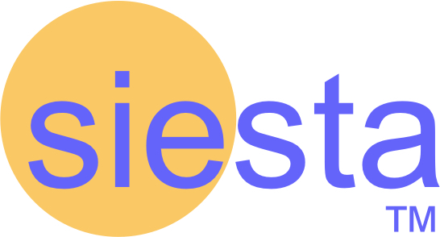

<h1 align="center">Hi , I'm Rafael Barbosa</h1>
<h3 align="center">Data Scientist and PhD in Physics</h3>

<h3 align="center">Connect with me:</h3>

 

 
 

<h4 align="center">Languages and Tools</h4>

 

  
<h5 align="center">Programming Languages</h5>

 
    
 

  
<h5 align="center">Frontend Development</h5>

 
  
 

  
<h5 align="center">AI/ML</h5>

 
    
 

 
  

  
 <h5 align="center">Data Visualization</h5>

 
 
 <h5 align="center">Database</h5>

 
   

  
<h5 align="center">Devops</h5>

 
 
 

  
<h5 align="center">Software</h5>

 
 

  
<h5 align="center">Automation</h5>

 

  
<h5 align="center">Other</h5>

 
   
   

<h5 align="center">Computer Simulation
</h5>

 
   
 

 
 

 
 

 
 

  

